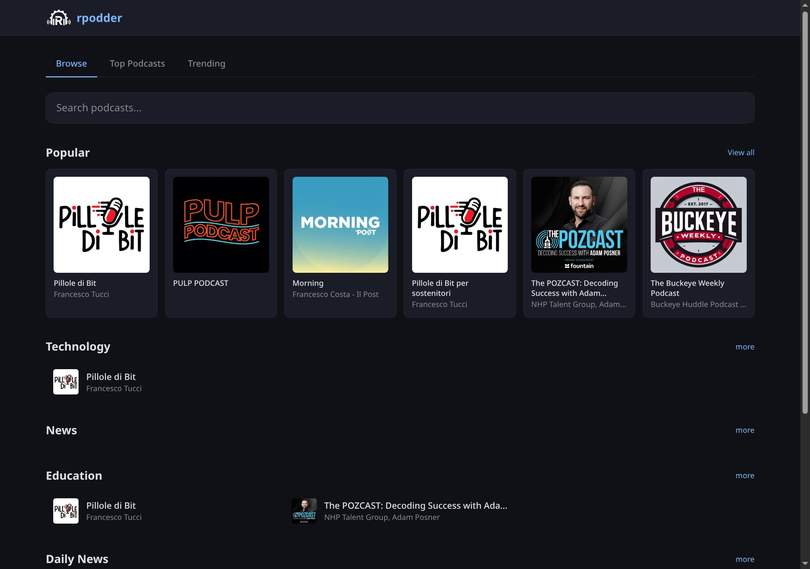

<p align="center">
  
</p>

<h1 align="center">rpodder</h1>

<p align="center">A modern, fast, <a href="https://gpodder.net">gpodder.net</a>-compatible podcast sync server written in Rust.</p>

<p align="center">
  <a href="https://github.com/thekoma/rpodder/actions/workflows/ci.yml"></a>
  <a href="https://github.com/thekoma/rpodder/pkgs/container/rpodder"></a>
  <a href="https://ghcr.io/thekoma/rpodder"></a>
  <a href="LICENSE"></a>
  
  
  
  
  
  
  <a href="https://thekoma.github.io/rpodder/"></a>
  
  
</p>

<p align="center">
  
</p>

Sync your podcast subscriptions and episode progress across [AntennaPod](https://antennapod.org), [gPodder](https://gpodder.github.io), [Kasts](https://apps.kde.org/kasts/), and any client that supports the [gpodder.net API](https://gpoddernet.readthedocs.io/).

## Features

- **Full gpodder API** — subscriptions, episode actions, devices, sync groups, settings, favorites, chapters, podcast lists
- **Web UI** — built-in Svelte 5 + Tailwind interface for browsing, searching, and managing podcasts
- **User roles** — admin/user system with first-user auto-admin, full user management panel
- **SSO/OAuth2** — OIDC single sign-on (Authentik, Keycloak, etc.) with group-based admin mapping
- **Registration control** — open, closed, or invite-only (email activation)
- **Password management** — self-service change/reset via email, admin set/reset, SSO-friendly
- **HTTPS upgrade suggestions** — detects HTTP subscriptions with HTTPS alternatives, proposes upgrade
- **Multi-format** — JSON, OPML, and TXT for subscription import/export
- **Dual database** — PostgreSQL for scale, SQLite for self-hosting
- **Feed indexing** — automatic feed fetching, parsing, fuzzy search, podcast directory
- **Dynamic migrations** — reads all `*.up.sql` from migrations directory, no hardcoded filenames
- **Privacy** — private/paid feeds (with tokens in URL) hidden from public directory
- **Lightweight** — single binary with embedded UI, low memory footprint

## Quickstart

### SQLite (self-hosted)

```bash
# Build
cargo build --release

# Initialize database and create an admin user
./target/release/rpodder migrate
./target/release/rpodder user create myuser mypassword --admin

# Start the server
./target/release/rpodder serve
```

The server starts on `http://localhost:3005`. Point your podcast app at this URL.

### Docker (SQLite)

```bash
docker compose --profile sqlite up -d
# Create a user
docker compose exec rpodder-sqlite rpodder user create myuser mypassword --admin
```

### Docker (PostgreSQL)

```bash
docker compose --profile release up -d
```

> The compose profiles above build from this checkout. To run the **published
> image** without building, use the deployment methods below.

## Deployment

Production self-hosting uses the published image
[`ghcr.io/thekoma/rpodder`](https://ghcr.io/thekoma/rpodder) — no build required.

### Docker Compose

Ready-to-use compose files live in [`examples/`](examples/). They import cleanly
into Dockge, Portainer and CasaOS.

```bash
# SQLite — simplest, single container
docker compose -f examples/docker-compose.yml up -d

# PostgreSQL — for multi-user instances
cp examples/.env.example examples/.env   # then set POSTGRES_PASSWORD
docker compose -f examples/docker-compose.postgres.yml up -d
```

Create the first admin user:

```bash
docker compose -f examples/docker-compose.yml exec rpodder rpodder user create <name> <password> --admin
```

### Kubernetes (Helm)

A self-managed chart built on the [bjw-s common library](https://bjw-s-labs.github.io/helm-charts)
lives in [`deploy/helm/rpodder/`](deploy/helm/rpodder/):

```bash
helm dependency build deploy/helm/rpodder
helm install rpodder deploy/helm/rpodder \
  --set ingress.main.enabled=true \
  --set 'ingress.main.hosts[0].host=podcasts.example.com'
```

Defaults to SQLite on a PersistentVolumeClaim; point `RPODDER_DATABASE_URL` at
PostgreSQL for multi-user. See the [chart README](deploy/helm/rpodder/README.md).

### TrueCharts

We're looking into [TrueCharts](https://truecharts.org) support. Once we've
carefully gone through their contribution guidelines, we may add rpodder to the
catalog. Until then, use the Helm chart above.

### Bare metal (systemd)

See [Systemd](#systemd) below.

## Configuration

All settings can be set via environment variables or a TOML config file:

| Env var | Default | Description |
|---------|---------|-------------|
| `RPODDER_DATABASE_URL` | `sqlite://rpodder.db` | Database connection URL |
| `RPODDER_HOST` | `0.0.0.0` | Bind address |
| `RPODDER_PORT` | `3005` | Bind port |
| `RPODDER_RUN_MIGRATIONS` | `true` | Run migrations on startup |
| `RPODDER_REGISTRATION` | `open` | `open` / `closed` / `invite` |
| `RPODDER_SMTP_HOST` | | SMTP server for email features |
| `RPODDER_OAUTH_ISSUER_URL` | | OIDC issuer URL for SSO |
| `RPODDER_OAUTH_CLIENT_ID` | | OAuth2 client ID |
| `RPODDER_OAUTH_CLIENT_SECRET` | | OAuth2 client secret |
| `RPODDER_OAUTH_ADMIN_GROUP` | | OIDC group name for admin role |
| `RPODDER_BASE_URL` | | Public URL for OAuth callbacks and emails |
| `RPODDER_PODCASTINDEX_KEY` | | [Podcast Index](https://podcastindex.org/) API key (free) |
| `RPODDER_PODCASTINDEX_SECRET` | | Podcast Index API secret |

Or use a config file: `rpodder -c config.toml serve`

See [`config/rpodder.example.toml`](config/rpodder.example.toml) for an example.

## CLI

```
rpodder serve                                    # Start the server
rpodder migrate                                  # Run database migrations
rpodder user create <username> <password>         # Create a user
rpodder user create <username> <password> --admin # Create an admin user
rpodder user delete <username>                    # Deactivate a user
rpodder repair                                   # Rebuild FTS5 index (SQLite)
```

## Client Setup

### AntennaPod
Settings → Synchronization → Choose provider → gpodder.net
Server: `http://your-server:3005` • Username/Password as created above

### Kasts (KDE)
Settings → Synchronization → Custom server
`http://your-server:3005`

### gPodder Desktop
Preferences → gpodder.net → Server URL: `http://your-server:3005`

## API Endpoints

| Endpoint | Description |
|----------|-------------|
| `POST /api/2/auth/{user}/login.json` | Login (HTTP Basic Auth) |
| `GET/PUT /subscriptions/{user}/{device}.{json,opml,txt}` | Subscription sync |
| `GET/POST /api/2/subscriptions/{user}/{device}.json` | Delta subscription sync |
| `GET/POST /api/2/episodes/{user}.json` | Episode action sync |
| `GET/POST /api/2/devices/{user}/{device}.json` | Device management |
| `GET /api/2/me` | Current user info |
| `POST /api/2/me/password` | Change password |
| `GET /api/2/me/upgrades` | HTTPS upgrade suggestions |
| `POST /api/2/register` | Public registration |
| `POST /api/2/password-reset` | Request password reset |
| `GET /search.json?q=...` | Podcast search |
| `GET /toplist/{count}.json` | Top podcasts |
| `GET /api/admin/users` | Admin: list users |
| `GET /api/admin/stats` | Admin: server statistics |
| `GET /health` | Health check |

See [`docs/API_REFERENCE.md`](docs/API_REFERENCE.md) for the complete API surface.

## Systemd

```bash
sudo cp target/release/rpodder /usr/local/bin/
sudo cp config/rpodder.service /etc/systemd/system/
sudo useradd -r -s /bin/false rpodder
sudo mkdir -p /var/lib/rpodder /usr/share/rpodder
sudo cp -r migrations /usr/share/rpodder/
sudo chown rpodder:rpodder /var/lib/rpodder
sudo systemctl enable --now rpodder
```

## License

AGPL-3.0-or-later
