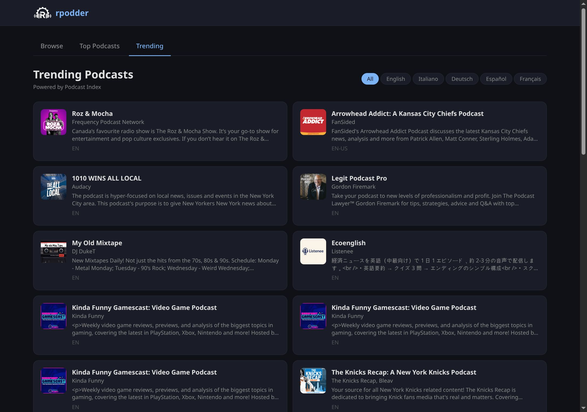
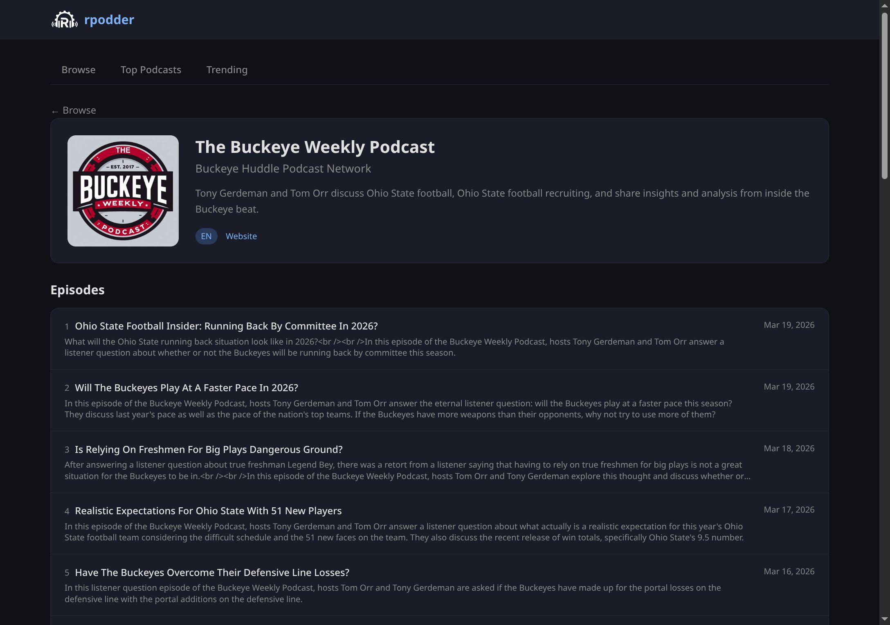
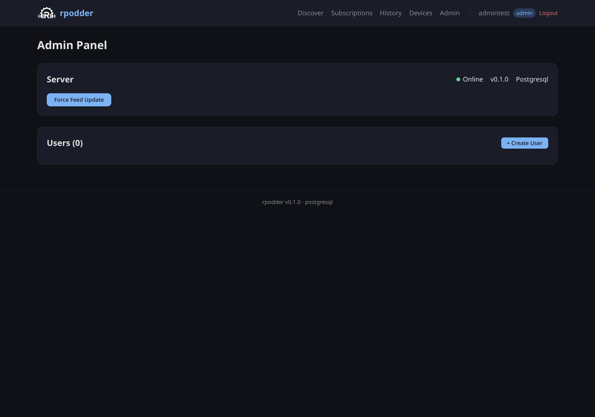

<div style="text-align: center; margin-bottom: 2rem;">
  
</div>

# rpodder

**A modern, self-hostable [gpodder.net](https://gpodder.net) replacement written in Rust.**

rpodder syncs your podcast subscriptions and episode progress across devices. It implements the [gpodder.net API](https://gpoddernet.readthedocs.io/) so you can use it with apps like [AntennaPod](https://antennapod.org), [gPodder](https://gpodder.github.io), and [Kasts](https://apps.kde.org/kasts/) — without depending on a third-party service.

## Why rpodder?

[gpodder.net](https://gpodder.net) has been the de facto standard for open podcast sync for years, but the original service is aging and the hosted instance is often unreliable. Several alternatives exist, but none quite hit the sweet spot we were looking for:

| Feature | gpodder.net | micro-gpodder | gpodder2go | opodsync | **rpodder** |
|---------|:-----------:|:-------------:|:----------:|:--------:|:-----------:|
| Full gpodder API | Yes | Partial | Partial | Partial | **Yes** |
| Web UI | Yes | No | No | No | **Yes** |
| Self-hostable | No | Yes | Yes | Yes | **Yes** |
| SSO / OAuth2 | No | No | No | No | **Yes** |
| External search (Podcast Index) | No | No | No | No | **Yes** |
| Dual database (PG + SQLite) | No | SQLite | SQLite | SQLite | **Yes** |
| Single binary | No | Yes | Yes | Yes | **Yes** |
| Written in | Python | Python | Go | Rust | **Rust** |

rpodder aims to be the gpodder.net you'd build today: fast, secure, self-hostable on a Raspberry Pi, yet scalable to thousands of users with PostgreSQL.

## Features at a glance

- **Full gpodder.net API** — subscriptions, episode actions, devices, sync groups, settings, favorites, chapters, podcast lists
- **Built-in web UI** — Svelte 5 + Tailwind, embedded in the binary. Browse, search, manage subscriptions, admin panel
- **Podcast Index integration** — search millions of podcasts, trending charts with language filters
- **SSO / OAuth2** — OIDC single sign-on with any provider (Authentik, Keycloak, Google, etc.)
- **User roles** — admin/user system, first-user auto-admin, group-based admin mapping
- **Password management** — self-service change/reset, admin override, SSO-friendly
- **HTTPS upgrade suggestions** — detects insecure subscriptions and proposes upgrade
- **Privacy** — private/paid feeds with tokens in URL are hidden from the public directory
- **Dual database** — PostgreSQL for production, SQLite for personal use
- **Single binary** — one `rpodder` binary with everything included
- **Docker ready** — multi-stage Dockerfile, compose profiles for every scenario

## Screenshots

<div style="display: grid; grid-template-columns: 1fr 1fr; gap: 1rem;">
  <div>
    
    <p style="text-align:center; font-size:0.8rem; color:#888;">Browse & Search</p>
  </div>
  <div>
    
    <p style="text-align:center; font-size:0.8rem; color:#888;">Trending (Podcast Index)</p>
  </div>
  <div>
    
    <p style="text-align:center; font-size:0.8rem; color:#888;">Podcast Detail</p>
  </div>
  <div>
    
    <p style="text-align:center; font-size:0.8rem; color:#888;">Admin Panel</p>
  </div>
</div>

## Quick taste

```bash
# SQLite mode — up and running in 30 seconds
docker compose --profile sqlite up -d
docker compose exec rpodder-sqlite rpodder user create myuser mypass --admin
# Open http://localhost:3005
```

## About this project

!!! info "100% Vibe Coded"
    Let's be upfront: **rpodder is 100% vibe coded.** Every line of Rust, every Svelte component, every SQL migration, and even this documentation was written through collaborative sessions between a human ([@thekoma](https://github.com/thekoma)) and Claude (Anthropic's AI). We believe in radical transparency about how software is made.

    Does this mean the code is bad? No — it has 90+ tests, passes clippy with zero warnings, and has been tested with real podcast clients. It means we used AI as a force multiplier to build something that would have taken months in days.

    We think this is the future of software development, and we're not going to pretend otherwise.

## License

rpodder is licensed under [AGPL-3.0-or-later](https://www.gnu.org/licenses/agpl-3.0.en.html). This means you can use, modify, and distribute it freely, but if you run a modified version as a service, you must share the source code.
