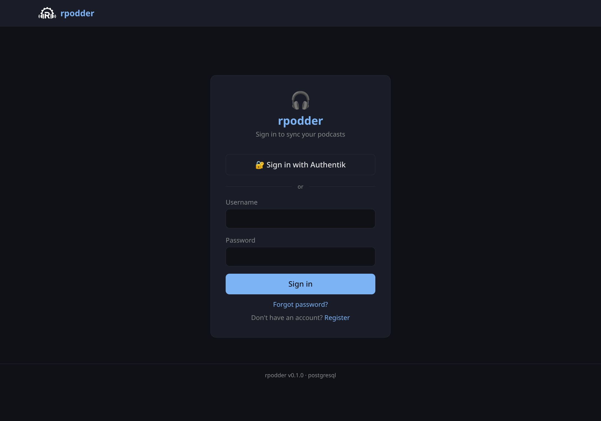

# Web Interface

rpodder includes a built-in web interface built with Svelte 5 and Tailwind CSS v4. It's embedded directly in the binary via `rust-embed`, so there's nothing extra to deploy.

## Navigation

The top navigation bar shows:

- **rpodder** — home page with popular podcasts
- **Discover** — browse, search, and trending podcasts
- **Subscriptions** — your podcast subscriptions
- **History** — your episode action history
- **Devices** — manage your sync devices
- **Admin** — admin panel (visible only for admins)
- **Username** — click to access settings (change password, profile info)

## Pages

### Home

Shows popular podcasts from your instance. A good starting point to see what others are listening to.

### Discover

Three tabs for finding new podcasts:

- **Browse** — search bar (searches both local database and Podcast Index), popular podcasts, category sections, tag cloud
- **Top Podcasts** — ranked table by subscriber count with visual bars
- **Trending** — trending podcasts from [Podcast Index](https://podcastindex.org) with language filters (All, English, Italiano, Deutsch, Español, Français)

When you search, results are split into two sections:

- **Local results** — podcasts already indexed in your rpodder database
- **Podcast Index** — results from the external database, with a **+ Add** button to subscribe

### Subscriptions

Grid view of your subscriptions with podcast logos, titles, and authors. Hover over a card to see the **Unsubscribe** button. Click a card to see the podcast detail page with episodes.

If any of your subscriptions use HTTP and an HTTPS alternative exists, a yellow **HTTPS upgrade** banner appears at the top with options to upgrade individual subscriptions or all at once.

### History

Paginated list of your episode actions (play, download, etc.) with podcast and episode titles, timestamps, and play positions.

### Devices

List of your sync devices with subscription counts. You can rename devices (inline editing) or delete them.

### Settings

Access by clicking your username in the nav bar. Shows your profile info and a form to change your password. SSO users who never set a password can leave the "Current Password" field blank.

### Admin Panel

See the [Admin Guide](../admin-guide/user-management.md) for details.

## Dark theme

The web UI uses a dark theme by default, designed for comfortable reading and minimal eye strain.

## Mobile

The interface is responsive and works on mobile devices, though it's optimized for desktop use. For mobile podcast management, we recommend using a dedicated app like AntennaPod with rpodder as the sync backend.
